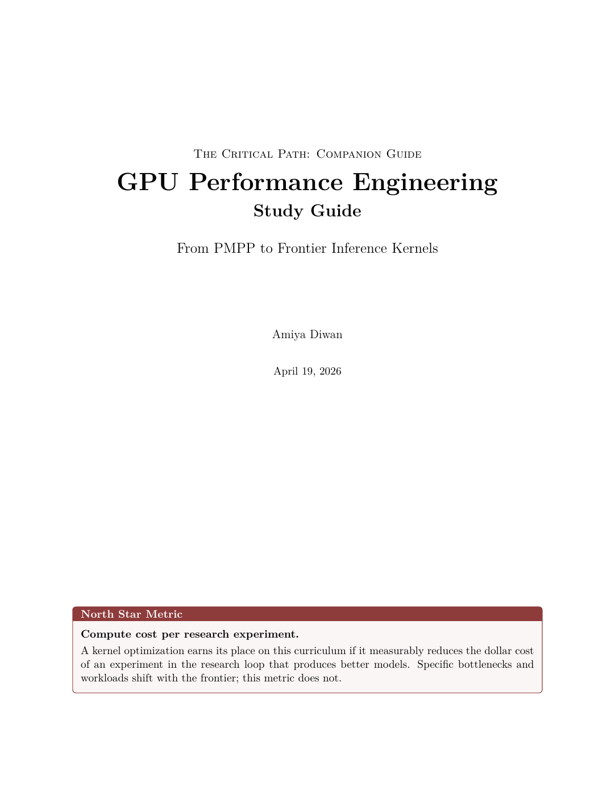

# kernel-forge

A hands-on CUDA kernel engineering curriculum for the path from PMPP fundamentals to frontier inference kernels.

The goal is engineering judgment: diagnose why a model-serving workload is slow, predict which optimization should matter, validate the prediction with measurements, and explain the result in terms that transfer across hardware generations.

<p align="center">
  <a href="docs/study-guide.pdf">
    
  </a>
</p>

## Start Here

The best overview is the [GPU Performance Engineering Study Guide](docs/study-guide.pdf). It names the north star (tokens per dollar), describes the predict-validate-explain loop, and walks through why these seven kernels are on the critical path.

This repo is the companion codebase. It provides the build system, runners, timing, profiling hooks, correctness checks, and stub kernels. The learner writes the kernels and records the reasoning in `wiki/` and `docs/notes/`.

See `docs/specs/2026-04-19-kernel-forge-design.md` for the design and literature review.

## What This Demonstrates

The artifact is the loop:

1. Identify the bottleneck from first principles.
2. Predict the performance effect of an optimization.
3. Implement the kernel.
4. Verify correctness against a reference.
5. Measure performance and explain the gap between prediction and result.

Start with SGEMM to learn memory hierarchy and arithmetic intensity. End with FlashAttention, quantized GEMM, and MoE dispatch because those kernels change inference economics.

## Critical path


| Order | Exercise        | Transferable principle                                     | Measured |
| ----- | --------------- | ---------------------------------------------------------- | -------- |
| 1     | matmul (naive)  | Memory-bound bottleneck analysis                           | —        |
| 2     | matmul (tiled)  | Shared-memory tiling reduces global traffic                | —        |
| 3     | reduction       | Tree-based parallelism, warp shuffle primitives            | —        |
| 4     | cross_entropy   | Kernel fusion eliminates intermediate materialization      | —        |
| 5     | flash_attention | Online algorithms replace materialization with bounded mem | —        |
| 6     | quantized_gemm  | Bandwidth optimization through reduced precision           | —        |
| 7     | moe_dispatch    | Irregular parallelism, gather–compute–scatter              | —        |


## Quickstart

```bash
make build                            # configures via CMake and builds all exercises
make run EX=matmul K=1                 # run naive matmul (4096 x 4096 x 4096 default)
make run EX=matmul K=0                 # time cuBLAS for the same shape — the target
./build/matmul 2 2048 2048 2048        # any runner takes CLI sizes
make profile EX=matmul K=1             # ncu --set full, saves to benchmark_results/
make bench EX=matmul                   # sweep kernels 0-2 across sizes {128..4096}, emits CSV
make plot EX=matmul                    # chart kernel variants vs size, PNG next to CSV
make clean
```

`K=0` times cuBLAS only in `matmul` — that is the one exercise with a drop-in single-library reference. For `reduction`, `cross_entropy`, `flash_attention`, `quantized_gemm`, and `moe_dispatch`, `K` starts at `1` and variant 1 is the baseline you compare later variants against. (Correctness for all exercises is still checked against a CPU reference inside the runner.)

Each runner emits a trailing `RESULT exercise=... kernel=... ms=... gflops=...` line. `scripts/parse_results.py` turns the swept log into CSV, and `scripts/plot.py` charts it. Override the sweep via env vars:

```bash
make bench EX=matmul KERNELS="0 1 2" SIZES="1024 2048 4096"
```

## Compute capability

Set in `CMakeLists.txt` via `CUDA_COMPUTE_CAPABILITY` (defaults to `80` for A100).


| GPU  | Capability | Typical use                         |
| ---- | ---------- | ----------------------------------- |
| L4   | 89         | Budget exercises (phases 1–4)       |
| A100 | 80         | Full profiling (phase 5+)           |
| H100 | 90         | Large-scale kernels, FlashAttention |


Override at configure time: `cmake -DCUDA_COMPUTE_CAPABILITY=89 ..`

## Directory layout

```
CMakeLists.txt            Makefile         README.md
common/   runner.cuh      utils.cuh
kernels/  matmul/         reduction/       cross_entropy/
          flash_attention/ quantized_gemm/ moe_dispatch/
runners/  *.cu            one main() per exercise
docs/     specs/          study-guide.tex
wiki/     type-dispatch, blocks-and-threads, ... (knowledge base)
archive/  pmpp/ pmpp_v2/ princeton/   (legacy popcorn work)
benchmark_results/         ncu exports  (created by `make profile`)
```

Each kernel variant lives in its own `.cuh` header. To add a new variant: create `kernels/<exercise>/N_name.cuh`, add an `#include` + `case N:` to `runners/<exercise>.cu`, and rebuild. To add a new exercise: create a new kernel subdirectory, a new runner `.cu`, and add its name to the `EXERCISES` list in `CMakeLists.txt`.

## Acknowledgements

The build system, profiling workflow, and kernel progression in this project are directly inspired by Simon Boehm's [How to Optimize a CUDA Matmul Kernel for cuBLAS-like Performance](https://siboehm.com/articles/22/CUDA-MMM) and its companion repository [siboehm/CUDA-MMM](https://github.com/siboehm/CUDA-MMM).

The curriculum follows *Programming Massively Parallel Processors* (4th ed.) by Hwu, Kirk, and El Hajj, supplemented by exercises from the [GPU Mode](https://discord.gg/gpumode) community.